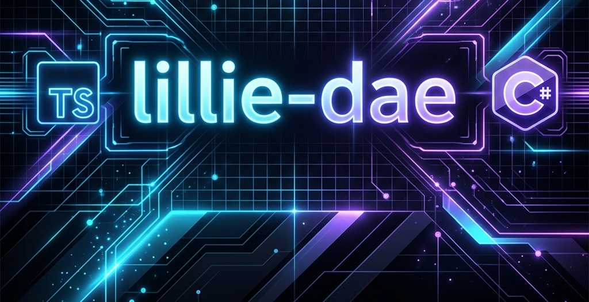

# Welcome to My GitHub Profile! 🚀

  

 

  <!-- Typing Animation -->
  

  <!-- Profile Visitor Counter & Status Badges -->
  

    
    
  

---

## 💫 About Me

I am a **Tech Wrangler, Code & Data Janitor, and Enterprise Architect**. I excel at taming complex distributed systems, cleaning up messy data pipelines, refactoring legacy codebases, and designing highly resilient enterprise architectures. I bring sanity and structure to chaotic software environments.

- 🌌 **Currently working on:** Streamlining enterprise system integrations and multi-tenant data pipelines.
- ⚡ **Fun Fact:** I treat debugging legacy code like a forensic investigation.
- 🌱 **Learning:** Event-driven architecture scaling patterns and AI-assisted workflows.
- 💬 **Ask me about:** Enterprise patterns, C#, SQL query tuning, and clearing architectural debt.

---

## 🛠️ My Tech Stack

<table width="100%">
  <tr>
    <td valign="top" width="50%">
      <h4>⚡ Frontend Engineering</h4>
      
      
      
      
      
    </td>
    <td valign="top" width="50%">
      <h4>⚙️ Backend & Services</h4>
      
      
      
      
      
      
      
    </td>
  </tr>
  <tr>
    <td valign="top" width="50%">
      <h4>🏗️ Architectural Patterns</h4>
      
      
      
      
      
    </td>
    <td valign="top" width="50%">
      <h4>🚀 DevOps & Tools</h4>
      
      
      
      
      
      
    </td>
  </tr>
</table>

---

## 💡 Daily Inspiration

  

---

## 🤝 Connect with Me

  
  <!--  -->

